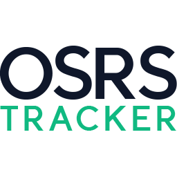

<p align="center">
  <a href="LICENSE"></a>
  <a href="https://github.com/osrs-tracker/osrs-tracker-web/issues"></a>
  &middot;
  <a href="https://github.com/osrs-tracker/osrs-tracker-web/actions/workflows/nodejs.yml"></a>
  <a href="https://github.com/osrs-tracker/osrs-tracker-web/actions/workflows/deploy.yml"></a>
</p>

<div align="center">
  <a href="https://osrs-tracker.freekmencke.com">
    <picture>
      <source media="(prefers-color-scheme: dark)" srcset="public/favicon-dark.png">
      
    </picture>
    <div>Visit OSRS Tracker</div>
  </a>

  <br />

  <p align="center">Keep track of everything that matters in Old School RuneScape. <br>Track the latest news, item prices, hiscores, and XP gains.</p>
</div>

## Features

- **XP Tracker**: look up any player and follow their daily XP gains, levels, boss kills, clue scrolls and more. Keep a
  list of your favourite players to check on your (and your friends') progress.
- **Price Tracker**: search any tradeable item and see its current Grand Exchange price, trends, and price and volume
  charts from the last day up to the last year.
- **OSRS News**: the latest Old School RuneScape news on the home page.

## How it fits together

This repository is the website. It is one of three parts:

- **[osrs-tracker-web](https://github.com/osrs-tracker/osrs-tracker-web)** (this repo): the website at
  [osrs-tracker.freekmencke.com](https://osrs-tracker.freekmencke.com).
- **[osrs-tracker-api](https://github.com/osrs-tracker/osrs-tracker-api)**: the API that serves player, item and news
  data to the website.
- **[osrs-tracker-aws](https://github.com/osrs-tracker/osrs-tracker-aws)**: background jobs that save a daily snapshot
  of every tracked player and keep the item list up to date, plus shared packages.

Live hiscores come from the official Old School RuneScape hiscores, and prices come from the
[OSRS Wiki prices API](https://prices.runescape.wiki).

## Running it locally

You need Node 24 or later.

```bash
npm ci
npm start
```

The site runs at [localhost:4200](http://localhost:4200) and uses the live API. Run it on port 4200, because the API
only accepts requests from that address when running locally. If something else is using the port, `ng serve` offers
another one: decline and stop the other process instead.

Local runs use the production API, so player lookups show up in the live "Global recent lookups".

## Contributing

Before pushing, run the same checks as CI:

```bash
npx ng build --configuration production && npx ng lint && npm run prettier:ci && npx ng test --watch=false
```

CI builds with `npm run build` instead, which also regenerates the sitemaps and icons and optimises chunks, so a build
that only breaks with chunk optimisation shows up in CI first (`npm run build` reproduces it; see below).
`npm run prettier` fixes formatting, and `npm test` runs the tests in watch mode. Pushes made by Claude Code are linted
first by `.claude/hooks/pre-push-check.sh`; your own `git push` isn't, so CI catches it.

`npm start` doesn't run the server code (page cache, pre-rendering). To test that, build and run the production server.
`npm run build` also regenerates the sitemaps (fetching the Wiki's item list and the API's player list) and the icons,
so run `git restore public/sitemap*.xml` afterwards:

```bash
npm run build
HOST=localhost PORT=4200 node dist/osrs-tracker-web/server/server.mjs
```

Merging to `main` deploys: once CI passes, [the CD workflow](.github/workflows/deploy.yml) builds and pushes the image
and commits its digest to `osrs-tracker-web.yaml`, which Flux applies to the cluster. Conventions, the deploy and the
release flow are in [.claude/skills/osrs-tracker-web/SKILL.md](.claude/skills/osrs-tracker-web/SKILL.md), rollback in
[docs/runbook.md](docs/runbook.md).

## Built with

Angular with server-side rendering, Tailwind CSS and Chart.js, running on Node 24 in Docker on Kubernetes.

## Development

OSRS Tracker was originally built entirely without AI assistance. Since October 2026, I've started using
[Claude](https://claude.com/claude-code), Anthropic's AI coding assistant, to help improve development speed and
reliability.

## License

[Elastic License 2.0](LICENSE): you're welcome to read the code, learn from it, change it and run it yourself, but not
to offer it to others as a hosted service, paid or free.
