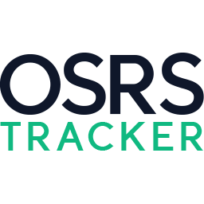

  &nbsp;
  &nbsp;

  <a href="https://osrs-tracker.freekmencke.com">
    <picture>
      <source media="(prefers-color-scheme: dark)" srcset="./src/favicon-dark.png">
      
    </picture>
  </a>

  
Keep track of everything that matters in Old School Runescape.  Track the latest news, item prices, hiscores, and XP gains.

